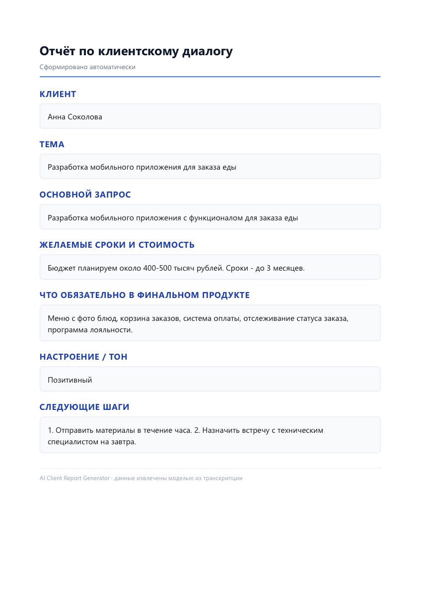
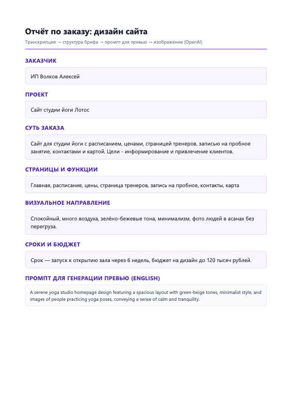

**[Русская версия](README.md)**

# AI Report Generator

**Structured business report PDF generator powered by LLM**

The service automatically transforms text transcripts (client dialogs, briefs) into professional PDF documents. It supports three modes: client dialog report, website design brief with preview, and marketplace product card.


### Report examples

**Client dialog report**


**Website design brief**


**Marketplace product card**


---

## 🚀 Features

| Mode | What it does | Output |
|------|-------------|--------|
| **Client** | Analyzes a client dialog transcript | PDF with fields: client, topic, request, deadlines/budget, product, mood, next steps |
| **Design** | Processes a website design brief/order | Structured brief + AI-generated preview image in PDF |
| **Marketplace** | Creates a product card from name and price | Product card with AI-generated background, description, and price |

### Technical highlights

- **OpenAI-compatible API** — works with official OpenAI or gateways (ProxyAPI, etc.)
- **Flask API** — integrate into existing workflows via `POST /generate`
- **Flexible input** — files, stdin, interactive mode
- **Detailed logging** — `-v` mode for debugging

---

## 📦 Project Structure

```
ai-report-generator/
├── main.py                 # Entry point, CLI + Flask API
├── utils/
│   ├── ai_processor.py     # LLM transcript processing
│   ├── pdf_generator.py    # PDF generation via WeasyPrint
│   └── logging_setup.py    # Logging configuration
├── templates/
│   ├── report_template.html
│   ├── report_design_template.html
│   └── report_marketplace_template.html
├── input/                  # Sample transcripts
├── screen/                 # Report screenshots for README
├── reports/                # Generated PDFs (gitignored)
├── requirements.txt
├── .env.example
└── README.md
```

---

## ⚙️ Installation

### Requirements

- Python 3.10+
- OpenAI API key or compatible gateway key (e.g., [ProxyAPI](https://proxyapi.ru/))

### Steps

```bash
# 1. Clone the repository
git clone https://github.com/CherkasovAV/ai-report-generator.git
cd ai-report-generator

# 2. Create a virtual environment
python -m venv .venv

# 3. Activate it
# Windows:
.venv\Scripts\activate
# Linux/macOS:
source .venv/bin/activate

# 4. Install dependencies
pip install -r requirements.txt

# 5. Set up environment variables
cp .env.example .env
```

### System dependencies

**WeasyPrint** requires system libraries. On Windows, install [GTK3](https://docs.gtk.org/gtk3/getting_started/windows.html) or use the [official WeasyPrint installer](https://doc.courtbouillon.org/weasyprint/stable/first_steps.html#installation).

On Linux:
```bash
# Debian/Ubuntu
sudo apt-get install libpango1.0-dev libharfbuzz-dev libffi-dev

# Fedora
sudo dnf install pango-devel harfbuzz-devel libffi-devel
```

---

## 🔐 Environment Configuration

Edit `.env`:

```env
# API key (OpenAI or gateway)
PROXY_API_KEY=your-api-key-here

# Base URL for OpenAI-compatible API (required for gateways)
OPENAI_BASE_URL=https://api.proxyapi.ru/openai/v1

# Direct OpenAI key (if set — used instead of PROXY_API_KEY)
# OPENAI_API_KEY=sk-...

# Chat model
OPENAI_MODEL=gpt-4o-mini

# Image generation model (design mode)
OPENAI_IMAGE_MODEL=gpt-image-1
OPENAI_IMAGE_SIZE=1024x1024
OPENAI_IMAGE_QUALITY=medium
```

| Variable | Required | Description |
|----------|----------|-------------|
| `PROXY_API_KEY` | Yes* | Gateway key (ProxyAPI, etc.) |
| `OPENAI_BASE_URL` | Yes* | API URL for gateways |
| `OPENAI_API_KEY` | Yes* | Direct OpenAI key |
| `OPENAI_MODEL` | No | Chat model (default: `gpt-4o-mini`) |
| `OPENAI_IMAGE_MODEL` | No | Image model (default: `gpt-image-1`) |

\* One of the following is required: `OPENAI_API_KEY` **or** `PROXY_API_KEY` + `OPENAI_BASE_URL`

---

## 🎯 Usage

### Quick start

```bash
# Run with a sample
python main.py input/sample_transcript.txt

# Design mode
python main.py --report design input/sample_design_transcript.txt

# Marketplace product card
python main.py --report marketplace --product "Ceramic mug 350ml" --price "890 ₽"
```

### Interactive menu

```bash
python main.py
```

The menu offers:
1. Client dialog report
2. Website design brief
3. Marketplace product card
0. Enter a file path or transcript manually

### Keyboard input

```bash
python main.py -i
```

Type the text, then enter `END` on a separate line to finish.

### Verbose logging

```bash
python main.py -v input/sample_transcript.txt
```

---

## 🔌 Flask API

### Start server

```bash
python main.py --serve --host 127.0.0.1 --port 5000
```

### Endpoints

#### `GET /health`

Service health check.

```bash
curl http://localhost:5000/health
```

Response:
```json
{
  "status": "ok",
  "report_types": ["client", "design", "marketplace"]
}
```

#### `POST /generate`

Generate a report.

**For client/design:**
```bash
curl -X POST http://localhost:5000/generate \
  -H "Content-Type: application/json" \
  -d '{"transcript": "Dialog text...", "report_type": "design"}'
```

**For marketplace:**
```bash
curl -X POST http://localhost:5000/generate \
  -H "Content-Type: application/json" \
  -d '{
    "report_type": "marketplace",
    "product_name": "Wireless headphones",
    "price": "4990",
    "notes": "Emphasize noise cancellation"
  }'
```

Response:
```json
{
  "ok": true,
  "report": "reports/report_design_2024-05-14_15-30.pdf",
  "report_type": "design"
}
```

---

## 📄 Output Format

### `client` mode

Extracted fields:
- `client_name` — client name
- `topic` — conversation topic
- `main_request` — main request
- `deadlines_and_cost` — deadlines and budget
- `product_essentials` — product essence
- `mood` — mood/tone
- `next_steps` — next steps

### `design` mode

Extracted fields:
- `client_name`
- `project_title`
- `order_summary`
- `pages_and_features`
- `visual_direction`
- `deadlines_and_budget`
- `image_prompt` — preview generation prompt (English)
- `next_steps`

### `marketplace` mode

Generated fields:
- `product_name` — card title
- `price_display` — display price
- `description` — product description
- `image_prompt` — background prompt (English)

---

## ⚠️ Troubleshooting

### Connection errors (`Connection error`, `UnsupportedProtocol`)

1. Verify `OPENAI_BASE_URL` — must include the scheme (`https://...`)
2. Make sure the API key is valid
3. If using a proxy, set `HTTPS_PROXY=http://host:port`

### WeasyPrint errors (Windows)

```
GLib-GIO-WARNING ...
```

This is not an error — these are GTK informational messages. They are hidden when not running with `-v`.

### Flask API not responding

1. Make sure the port is not occupied by another process
2. Check logs for errors during server startup
3. Try a different port: `--port 5001`

---

## 📝 Usage Examples

### For agencies

Automate brief creation after client calls:

```bash
python main.py --report design call_transcript.txt
```

### For marketplace sellers

Generate product cards in batches:

```bash
python main.py --report marketplace --product "Headphones" --price "4990"
```

### For freelancers

Save meeting notes in a structured format:

```bash
python main.py meeting_notes.txt
```

---

## 🔒 Security

- **Never commit `.env`** — only `.env.example` belongs in the repository
- **Rotate keys** if you suspect a leak
- **Restrict access** to the Flask API in production

See [SECURITY.md](SECURITY.md) for details.

---

## 📄 License

MIT License — see [LICENSE](LICENSE)

---

## 👤 Author

**CherkasovAV**

GitHub: [@CherkasovAV](https://github.com/CherkasovAV)

---

## 🙋 Support

- Questions and suggestions: open an Issue in the repository
- Telegram: [@CherkasovAV](https://t.me/CherkasovAV)
- Email: [cherkasov83@yandex.ru](mailto:cherkasov83@yandex.ru)